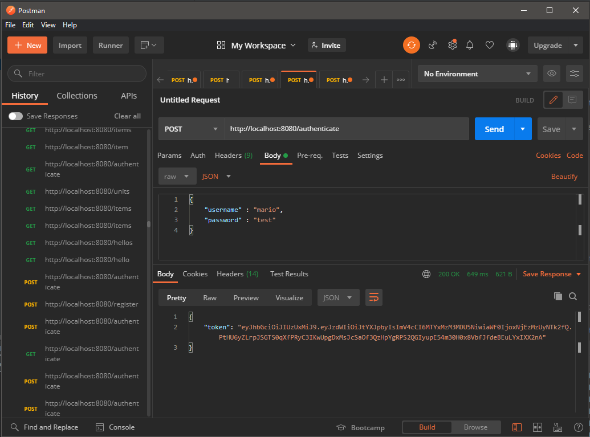

## Giveaway Random Item Generator API

### What you need

- IntelliJ, Eclipse
- Java Version 11
- Postman application for sending http request and JSON
- MySQL for Database Management System

#### How to Run

```
mvn spring-boot:run
```


### Rest API Description

Documentation : http://localhost:8080/swagger-ui.html

or you can run on Postman : http://localhost:8080

- /items
- /customer  *//you need authenticated to access this path*
- /units
- /quantity

JWT Documentation

http://localhost:8080/register //Register user with full authority


http://localhost:8080/authenticate //get token



Copy token with Bearer


